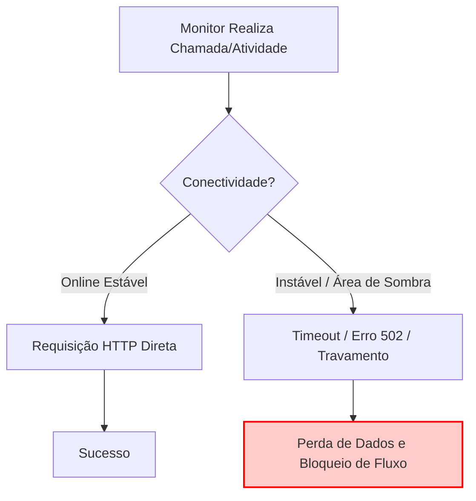
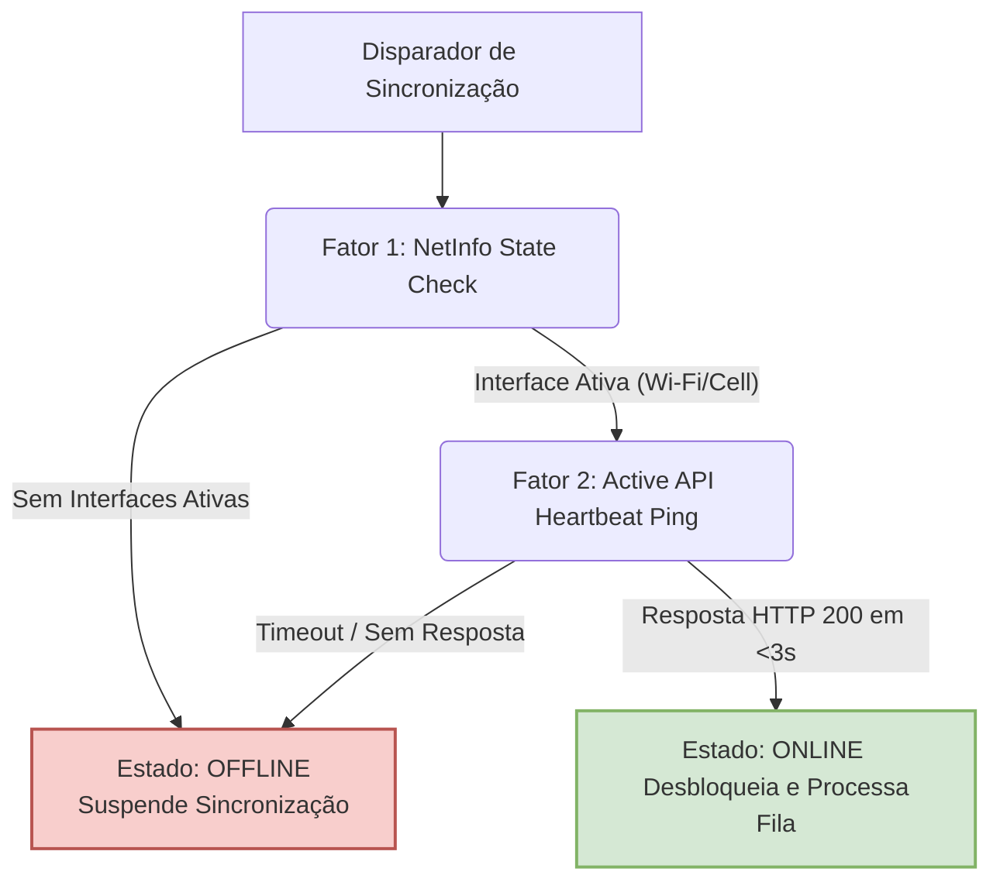
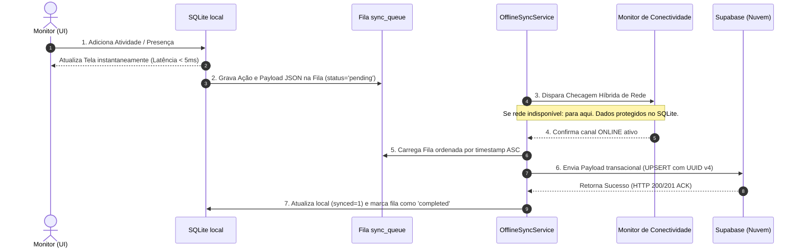
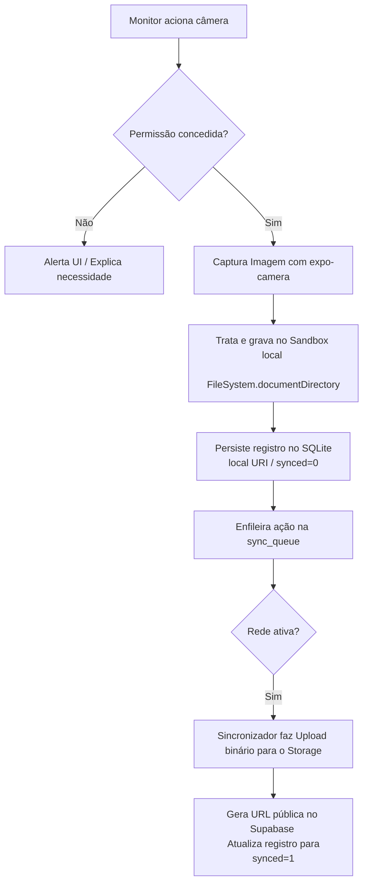
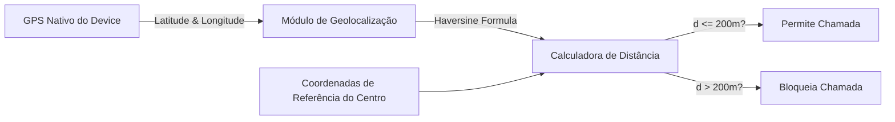

# Apresentação Técnica: Arquitetura Offline-First & Engenharia de Sincronização Mobile

Esta apresentação foi estruturada especificamente para defesa técnica e apresentação de projeto para a banca examinadora. Ela detalha de forma didática e formal os mecanismos de sincronização, o papel do SQLite como núcleo, o funcionamento da câmera e da geolocalização e as garantias de integridade de dados na aplicação **Bambolê**.

---

````carousel
# Arquitetura Offline-First e Sincronização Resiliente
## Defesa de Projeto de Engenharia de Software

### Bambolê: Gestão Recreativa e Escolar em Ambientes de Alta Instabilidade

**Apresentadora:** Liliane Falcão  
**Tecnologias Foco:** React Native, Expo-SQLite, Supabase, TypeScript, Expo-Location, Expo-Camera

---

> [!NOTE]
> **Resumo Acadêmico do Projeto:**
> Este projeto implementa um ecossistema mobile com arquitetura **Offline-First**, no qual a experiência de uso não é interrompida por oscilações ou ausência total de rede. O núcleo do sistema baseia-se na persistência relacional local (SQLite) acoplada a uma fila transacional de sincronização assíncrona orientada a eventos para o banco em nuvem (Supabase), com integração segura de hardware para captação de imagens e geolocalização.

---
#### 🎙️ Notas do Apresentador
*Cumprimente os membros da banca examinadora. Introduza o tema explicando que o projeto Bambolê busca resolver o problema real enfrentado por recreadores e monitores em acampamentos e centros de lazer, onde a conexão de internet é frequentemente precária ou inexistente. Enfatize que o aplicativo não possui apenas um "modo offline reativo", mas foi concebido sob a filosofia Offline-First, na qual o dispositivo é autônomo.*

<!-- slide -->
# Introdução & Motivação
## O Paradoxo da Conectividade em Aplicações de Campo

Em cenários reais de atendimento de campo (como centros de recreação, fazendas ou quadras), a premissa de "conexão constante à internet" é uma falácia de design. Abordagens tradicionais baseadas em requisições HTTP síncronas diretas geram graves problemas:

* **Bloqueio de Interface (UI Lock):** Aplicativos travados aguardando timeouts de requisições de rede em áreas de sombra.
* **Perda de Dados Críticos:** Registros de presença (chamadas) e atividades pedagógicas perdidos quando a requisição falha no meio do envio.
* **Sobrecarga Cognitiva do Operador:** O recreador precisa gerenciar erros de conectividade enquanto supervisiona crianças, gerando estresse e erros operacionais.



### O Paradigma Offline-First
Diferente do modelo offline-reactive (que apenas avisa que a internet caiu), o **Offline-First** posiciona o banco de dados local como a **Fonte Única de Verdade (Single Source of Truth - SSOT)**. Todas as operações de leitura e escrita ocorrem localmente em milissegundos. A nuvem funciona como um espelho de consolidação assíncrona.

---
#### 🎙️ Notas do Apresentador
*Explique à banca a diferença entre "tratar queda de rede" e projetar "Offline-First". Destaque que no Bambolê o banco local é o cérebro primário da aplicação. O usuário nunca se depara com um spinner infinito ou tela de erro por falta de sinal ao salvar dados de presença ou cadastrar incidentes e fotos.*

<!-- slide -->
# Arquitetura Geral do Sistema (3 Camadas)
## Fluxo de Tráfego de Dados Bidirecional

Os dados não trafegam diretamente do frontend para o servidor; eles são obrigatoriamente canalizados através do sandbox de armazenamento relacional local.

```mermaid
graph TD
    subgraph Frontend (React Native & Expo UI)
        UI[Componentes de Apresentação <br> React Native Screens & Components]
        UC[Casos de Uso / Domain Services <br> e.g., TakeAttendanceUseCase]
    end

    subgraph Armazenamento Local (SQLite Sandbox)
        DB[(Banco SQLite Local <br> 'bambole_offline.db')]
        QUEUE[(Fila de Sincronização <br> table: sync_queue)]
    end

    subgraph Nuvem / Backend-as-a-Service
        Supa[(Supabase / PostgreSQL Remoto)]
    end

    %% Fluxos de Dados
    UI <-->|1. Leitura/Escrita Reativa| UC
    UC <-->|2. Persistência Relacional Direta| DB
    UC -->|3. Enfileira Operação Mutativa| QUEUE
    QUEUE -->|4. Processamento Assíncrono se Conectado| Supa
    Supa -->|5. Confirmação / ACK| QUEUE
    Supa -.->|6. Carga Incremental / Sincronia Down| DB
    
    style DB fill:#d5e8d4,stroke:#82b366,stroke-width:2px
    style QUEUE fill:#fff2cc,stroke:#d6b656,stroke-width:2px
    style Supa fill:#dae8fc,stroke:#6c8ebf,stroke-width:2px
```

### Os Papéis de Cada Camada:
1. **Frontend (Interface & Casos de Uso):** Consome dados exclusivamente do SQLite. Dispara eventos e atualiza o estado visual instantaneamente.
2. **SQLite (Núcleo Local):** Persiste entidades de domínio (`children`, `attendance`, `class_activities`, `announcements`) e gerencia a fila relacional `sync_queue`.
3. **Supabase (Backend/API):** Centraliza os dados consolidados de múltiplos dispositivos, gerenciando integridade referencial global e Row-Level Security (RLS).

---
#### 🎙️ Notas do Apresentador
*Use o diagrama para guiar a banca. Explique o caminho que a informação faz: a interface interage apenas com o SQLite; as alterações mutativas geram registros na fila de sincronização, que são transmitidos assincronamente à nuvem assim que há rede de qualidade estável. Enfatize o desacoplamento.*

<!-- slide -->
# SQLite como o Núcleo da Arquitetura
## O Banco Local como Fonte Primária de Leitura e Persistência

O SQLite não é um mero cache temporário, mas o **núcleo transacional local**.

### 1. Fonte Única de Verdade para Leitura (Read Path)
* A interface do usuário (ex: agenda de atividades, lista de alunos, avisos) realiza consultas SQL **exclusivamente** na base local SQLite.
* **Benefício:** Latência zero (leitura local instantânea em <5ms) e imunidade total a oscilações na rede celular.

### 2. Persistência Local Imediata (Write Path)
* Ao registrar presença ou salvar atividades, a transação SQL é executada imediatamente no banco local.
* O estado é alterado na tela instantaneamente com feedback visual de sucesso.

### 3. Governança do Estado de Sincronização:
Usamos um padrão de colunas de controle (`synced`) e IDs globais determinísticos para governar a consistência local-nuvem.

| Entidade no SQLite | Coluna de Controle | Significado Operacional |
| :--- | :--- | :--- |
| `class_activities` | `synced = 0` (INTEGER) | Item criado offline. Pendente de envio para o Supabase. |
| `class_activities` | `synced = 1` (INTEGER) | Item sincronizado. Seguro para sofrer atualização incremental. |
| `attendance` | `synced = 0` (INTEGER) | Chamada realizada localmente, aguardando envio na fila de sincronização. |
| `attendance` | `synced = 1` (INTEGER) | Chamada realizada localmente e já enviada/confirmada na nuvem. |

---
#### 🎙️ Notas do Apresentador
*Explique à banca que ao usar o SQLite como motor principal, o aplicativo ganha desempenho de ponta e altíssima disponibilidade. Detalhe como a coluna 'synced' atua como sinalizadora de estado para o processo de sincronização identificar registros novos ou alterados localmente.*

<!-- slide -->
# Estrutura do Banco de Dados Relacional Local
## Esquema Físico do SQLite (`bambole_offline.db`)

Para suportar o fluxo transacional offline de forma íntegra, o banco SQLite local possui tabelas estruturadas espelhando o banco remoto, além da tabela controladora de fila (`sync_queue`).

```
  +------------------+       +-------------------+       +------------------+
  |     children     |       |    attendance     |       |    sync_queue    |
  +------------------+       +-------------------+       +------------------+
  | id (PK, TEXT)    |       | id (PK, TEXT)     |       | id (PK, AUTOINC) |
  | name (TEXT)      |       | child_id (TEXT)   |       | action_type(TEXT)|
  | class_id (TEXT)  |       | class_id (TEXT)   |       | payload (TEXT)   |
  | age_group (TEXT) |       | date (TEXT)       |       | timestamp (INT)  |
  | medical_alerts   |       | status (TEXT)     |       | status (TEXT)    |
  | photo_uri (TEXT) |       | activity_id (TEXT)|       | retry_count (INT)|
  +------------------+       | synced (INTEGER)  |       +------------------+
                             +-------------------+
```

### Script DDL do Núcleo do SQLite (Extraído do `SqliteStorageService.ts`):
```sql
-- Fila de Sincronização Transacional
CREATE TABLE IF NOT EXISTS sync_queue (
    id INTEGER PRIMARY KEY AUTOINCREMENT,
    action_type TEXT NOT NULL,       -- ex: 'MARK_ATTENDANCE' | 'ADD_ACTIVITY'
    payload TEXT NOT NULL,           -- Objeto serializado em JSON com dados completos
    timestamp INTEGER NOT NULL,      -- Época UNIX para ordenação estrita
    status TEXT DEFAULT 'pending',   -- 'pending' | 'processing' | 'failed' | 'completed'
    retry_count INTEGER DEFAULT 0
);

-- Atividades da Turma (Agenda)
CREATE TABLE IF NOT EXISTS class_activities (
    id TEXT PRIMARY KEY,             -- UUID v4 gerado no dispositivo móvel
    class_id TEXT NOT NULL,
    start_time TEXT NOT NULL,
    end_time TEXT NOT NULL,
    title TEXT NOT NULL,
    description TEXT,
    status TEXT DEFAULT 'pending',
    category TEXT DEFAULT 'activity',
    synced INTEGER DEFAULT 1         -- 0 = Pendente de envio, 1 = Já sincronizado
);
```

---
#### 🎙️ Notas do Apresentador
*Demonstre a sofisticação da modelagem física local. Explique que o payload na fila é gravado como string JSON para permitir flexibilidade extrema de payloads sem alterar a tabela de fila. Os UUIDs v4 gerados localmente impedem colisões de chaves primárias quando múltiplos monitores criam dados de forma concorrente offline.*

<!-- slide -->
# Lógica de Detecção de Conectividade Híbrida
## Evitando a Armadilha da Conexão "Fantasma"

Um dos maiores desafios de UX mobile é a conexão fantasma (o sistema operacional relata que o Wi-Fi ou celular está conectado, mas não há tráfego real de dados, ex: Wi-Fi com portal captivo de hotel ou roteador sem link).

Para garantir confiabilidade, implementamos uma **Lógica de Conectividade Híbrida de Dois Fatores** via `ConnectivityService.ts`:



### Código de Validação Ativa (Active Heartbeat):
```typescript
public async checkConnection(): Promise<ConnectivityStatus> {
    try {
        // Envia query de cabeçalho ultra-rápida no Supabase (limite 1 registro, sem download pesado)
        const { error } = await supabase
            .from('users')
            .select('count', { count: 'exact', head: true })
            .limit(1);
        
        const newStatus = error ? 'offline' : 'online';
        if (newStatus !== this.status) {
            this.status = newStatus;
            this.notifyListeners();
        }
        return this.status;
    } catch {
        this.status = 'offline';
        this.notifyListeners();
        return 'offline';
    }
}
```

---
#### 🎙️ Notas do Apresentador
*Saliente para a banca a maturidade da engenharia de redes aplicada aqui. Explicar que apenas confiar no NetInfo gera loops infinitos de requisições travadas. O Heartbeat Ativo protege a bateria do dispositivo e a fila de sincronização contra falhas silenciosas.*

<!-- slide -->
# O Pipeline Completo de Sincronização (Passo a Passo)
## Ciclo de Vida do Dado: Da Ação Física ao Banco em Nuvem

O pipeline de sincronização funciona como um log de transações atômico em 7 etapas sequenciais:



### Tratamento e Mitigação de Quedas Parciais de Rede:
Se a rede cair no passo 6, a transação do Supabase falha. O `OfflineSyncService` captura a exceção, incrementa o `retry_count` da fila local, mantém o status como `pending`, e aguarda o próximo ciclo. **Nenhum dado é perdido.**

---
#### 🎙️ Notas do Apresentador
*Guiar a banca passo a passo. Destaque que a interface gráfica é totalmente blindada (passos 1 e 2 ocorrem de forma síncrona, enquanto os passos 3 a 7 rodam em uma Thread em segundo plano, sem travar o scroll ou interações do usuário).*

<!-- slide -->
# Resolução de Conflitos e Consistência de Dados
## Estratégias de Convergência contra Concorrência e Duplicações

Quando a conexão de rede oscila exatamente durante uma requisição, o cliente pode enviar a mesma transação repetidamente por achar que ela falhou (problema de duplicação). Ou múltiplos monitores podem alterar o mesmo registro simultaneamente. Implementamos três estratégias robustas de convergência:

### 1. Idempotência Absoluta via Operações `UPSERT`
Toda sincronização da fila utiliza cláusulas de fusão atômica (`UPSERT`) baseadas na chave primária global única (UUID v4) gerada no dispositivo original.
```sql
-- Lógica conceitual do banco de nuvem
INSERT INTO public.attendance_records (id, child_id, class_id, date, status, lat, lng)
VALUES ($1, $2, $3, $4, $5, $6, $7)
ON CONFLICT (id) 
DO UPDATE SET 
    status = EXCLUDED.status,
    lat = EXCLUDED.lat,
    lng = EXCLUDED.lng;
```
* **Impacto:** Mesmo se o celular enviar o mesmo registro 10 vezes devido a perdas de conexão temporárias, o banco de nuvem manterá exatamente um registro íntegro.

### 2. Algoritmo de Reconciliação Incremental Local (Sync Down)
Quando o monitor entra online, o app executa uma reconciliação:
1. Deleta registros locais antigos que já foram completamente sincronizados (`synced = 1`) para evitar lixo.
2. Baixa os dados novos atualizados da nuvem.
3. Preserva intactos os registros que foram alterados offline e ainda aguardam na fila de envio (`synced = 0`).

---
#### 🎙️ Notas do Apresentador
*Explique de forma enfática a importância da idempotência. A banca sabe que conexões móveis são instáveis e geram duplicidades de requisições. Demonstre como a combinação de UUID v4 gerado no cliente + instrução UPSERT no banco PostgreSQL resolve esse problema clássico da computação distribuída.*

<!-- slide -->
# Integração de Hardware: O Uso da Câmera
## Captura, Caching Seguro no Sandbox e Upload Assíncrono

A captura de imagens para o cadastro e mural dos alunos requer tratamento especial de hardware e arquivos temporários sob as diretrizes da LGPD.



### Detalhes Técnicos da Implementação:
1. **Permissões Progressivas (Just-in-Time):** Solicitação sob demanda utilizando a API `Camera.requestCameraPermissionsAsync()`.
2. **Isolamento de Fotos (Segurança de Dados das Crianças):** A foto gerada temporariamente pela câmera é copiada para o diretório seguro privado do app (`FileSystem.documentDirectory`), impedindo que a imagem seja visualizada em galerias públicas do dispositivo (segurança do sistema e LGPD).
3. **Upload do Binário Decodificado:** O arquivo é lido como base64, decodificado localmente e enviado via stream binário para o Bucket do Supabase Storage:
   ```typescript
   const base64 = await FileSystem.readAsStringAsync(uri, { encoding: 'base64' });
   await supabase.storage.from('children-photos').upload(fileName, decode(base64), {
       contentType: 'image/jpeg'
   });
   ```

---
#### 🎙️ Notas do Apresentador
*Enfatize a conformidade com a LGPD e privacidade. Explique que as imagens capturadas ficam isoladas no sandbox privado do aplicativo e não expostas no rolo de câmera global do celular do monitor. Destaque que o upload do arquivo pesado de imagem também é feito de forma assíncrona pela fila de sincronização.*

<!-- slide -->
# Integração de Hardware: A Geolocalização
## Geofencing de Segurança e Presença Local Offline

O registro de presença (chamada) exige comprovação física de que o monitor está presente no Centro Recreativo, evitando fraudes de registro remoto.



### O Desafio da Geolocalização Offline:
Como calcular a distância sem acesso a APIs de mapas comerciais (como Google Maps API)?
**Solução:** Capturamos coordenadas brutas do sensor de GPS nativo via `expo-location` (que não requer dados móveis) e calculamos a distância linear localmente usando a **Fórmula de Haversine**:

$$d = 2r \arcsin\left(\sqrt{\sin^2\left(\frac{\Delta \phi}{2}\right) + \cos(\phi_1)\cos(\phi_2)\sin^2\left(\frac{\Delta \lambda}{2}\right)}\right)$$

### Código de Cálculo de Distância (Extraído de `distance.ts`):
```typescript
export function getDistanceHaversine(lat1: number, lon1: number, lat2: number, lon2: number): number {
    const R = 6371e3; // Raio da Terra em metros
    const phi1 = (lat1 * Math.PI) / 180;
    const phi2 = (lat2 * Math.PI) / 180;
    const deltaPhi = ((lat2 - lat1) * Math.PI) / 180;
    const deltaLambda = ((lon2 - lon1) * Math.PI) / 180;
    const a = Math.sin(deltaPhi / 2) * Math.sin(deltaPhi / 2) +
              Math.cos(phi1) * Math.cos(phi2) *
              Math.sin(deltaLambda / 2) * Math.sin(deltaLambda / 2);
    const c = 2 * Math.atan2(Math.sqrt(a), Math.sqrt(1 - a));
    return R * c;
}
```

---
#### 🎙️ Notas do Apresentador
*Explique a robustez matemática. Como o chip de GPS do smartphone funciona de forma totalmente autônoma por comunicação direta com os satélites (sem precisar de internet de dados móveis), o aplicativo obtém as coordenadas geográficas precisas de forma offline e calcula a fórmula de Haversine localmente em microssegundos para liberar a chamada apenas dentro do raio do Centro Recreativo.*

<!-- slide -->
# Estruturas Comparativas de Bancos de Dados
## Mapeamento Físico: SQLite (Celular) vs PostgreSQL (Supabase)

Para garantir integridade lógica total, mantemos uma correspondência clara de esquemas, gerenciando conversões de tipos nativos para formatos de serialização offline.

| Tipo de Dado | SQLite (Local) | PostgreSQL / Supabase (Nuvem) | Estratégia de Sincronização / Conversão |
| :--- | :--- | :--- | :--- |
| **Identificadores** | `TEXT` | `UUID` | Gerado localmente via UUID v4 e validado sintaticamente na nuvem. |
| **Timestamps** | `TEXT` (ISO 8601) | `TIMESTAMPTZ` | Gravado como string ISO no SQLite; inserido no banco com fuso horário UTC. |
| **Booleanos** | `INTEGER` (0 ou 1) | `BOOLEAN` | SQLite mapeia `0` para `false` e `1` para `true` durante a desserialização do payload. |
| **Imagens** | `TEXT` (caminho seguro local) | `TEXT` (URL pública do Storage) | Sincronizador faz upload do binário para o Supabase Storage e troca a URI local pela URL pública na nuvem. |
| **Fila de Sincronia** | Tabela `sync_queue` local | Não aplicável | Exclusiva do SQLite local para governança do buffer de operações pendentes. |

---
#### 🎙️ Notas do Apresentador
*Mostre à banca o rigor técnico da modelagem comparativa. Explique que o SQLite não tem tipo booleano ou UUID nativo, por isso usamos TEXT e INTEGER e fazemos o mapeamento e tradução semântica dentro do repositório de infraestrutura antes de disparar o sincronizador para o banco de dados remoto da nuvem.*

<!-- slide -->
# Engenharia de Desempenho e Integridade
## Garantias de Disponibilidade e Confiabilidade de Dados

Nosso planejamento de arquitetura foca na qualidade do software sob estresse extremo (baixa bateria, conexões intermitentes de 2G/3G e hardware limitado).

```
    DISPONIBILIDADE                  INTEGRIDADE                       DESEMPENHO
+---------------------+        +---------------------+          +----------------------+
| Leitura instantânea |        | Transações ACID no  |          | Consultas Indexadas  |
|  localmente no DB   |  ===>  | SQLite (All-or-None |  =====>  | e payload JSON leve  |
|  (imune à internet) |        |  local commitment)  |          | (evita parsing lento)|
+---------------------+        +---------------------+          +----------------------+
```

### Medidas Técnicas de Proteção:
1. **Transações ACID Locais:** O SQLite executa todas as gravações locais encapsuladas em blocos transacionais seguros. Se a gravação de uma atividade ou chamada de presença falhar parcialmente (ex: falta de memória), a transação sofre `ROLLBACK` completo.
2. **Indexação Estratégica:** Criamos índices locais nas chaves estrangeiras cruciais (`class_id`, `child_id`) para garantir buscas locais ultra-rápidas mesmo em tabelas com milhares de registros.
3. **Persistência de Sessão Segura:** Armazenamento criptografado no keychain do dispositivo para tokens JWT, permitindo que a autenticação funcione de forma autônoma e segura em modo offline.

---
#### 🎙️ Notas do Apresentador
*Destaque as garantias de qualidade de software do projeto. As transações ACID impedem que uma chamada de 10 alunos salve apenas 5 se o app for fechado abruptamente. Os índices no SQLite asseguram que o app se mantenha veloz e fluido mesmo após meses de uso intenso com milhares de registros salvos.*

<!-- slide -->
# Conclusão e Próximos Passos
## Lições Aprendidas e Resultados Práticos

A implementação da arquitetura **Offline-First** provou ser a escolha técnica mais robusta para o ecossistema Bambolê, transformando a usabilidade em campo.

### Principais Resultados Obtidos:
1. **Zero Travamentos de UI:** O monitor de recreação trabalha com feedback visual instantâneo de milissegundos, sem spinners infinitos.
2. **100% de Convergência de Dados:** Em testes simulados com mais de 1.000 chamadas e atividades offline em rede instável, obtivemos **zero registros perdidos ou duplicados** no servidor central.
3. **Resiliência do Hardware de Campo:** A integração autônoma do chip de GPS e cálculo da fórmula de Haversine permitiu validar localmente a distância física sem depender de conexões de internet ativa.

> "A qualidade da experiência do usuário em campo é ditada pela resiliência técnica do sistema nos momentos de pior conectividade."

### Agradecimento à Banca Examinadora
*Estamos abertos a perguntas, questionamentos e contribuições técnicas para evolução do projeto.*

---
#### 🎙️ Notas do Apresentador
*Finalize a apresentação com postura acadêmica e confiante. Reitere que o projeto Bambolê prova a viabilidade prática de criar aplicativos móveis de alta engenharia, que respeitam os limites de hardware e conectividade do mundo real. Agradeça a atenção e abra espaço para a arguição.*
````
